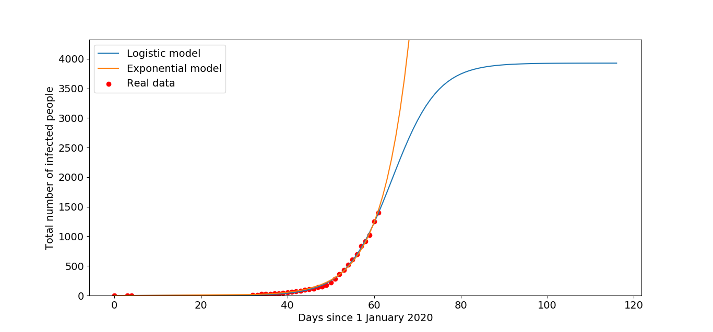
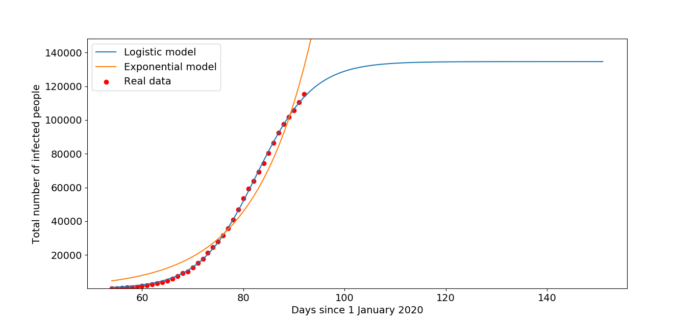

# covid19-LogisticAndExponential-_-India-Predict-Trend

Using Logistic regression to predict death due to corna Virus.
We will compare it with Exponential case .

Note: Exponential Case is the Extreme Case where all of the population gets infected in next 2 weeks time.
Logistic Regression is the ideal case we need it to end, with the current trend shown.

But the reality will be in between these 2 curves , and it depends on a lot of actions taken, policies and mistakes and economic states.

India Estimates as of *02-04-2020* . 
on Ideal case it stops with 4000 to 5000 peoples with little changes for coming months. Or on Extreme case 5 lakh get infected in next 2 weeks. More data or facts give more clarity for prediction.

Italy have reached their final stages. so Logistical Curve may hold true. As almost 0.2% of their population got infected as per government sources. Whereas in India recorded Infected peoples are 0.000118623% only.

